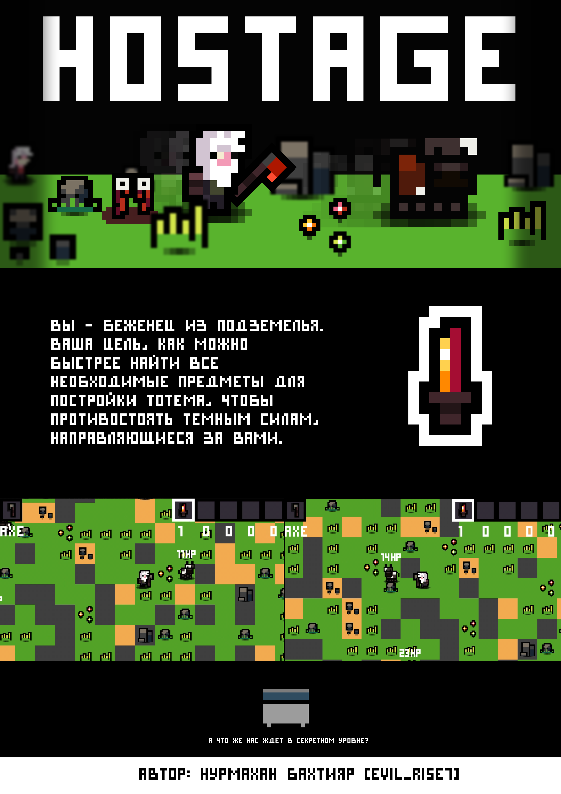

# Hell Obtained Sensible Tiny And Geniusly Emmy

## Description
[EN] You are a refugee from the dungeon. Your goal is to find all the necessary items for building the totem as quickly as possible in order to resist the dark forces that are heading for you.
## Описание игры
[RU] Вы - беженец из подземелья. Ваша цель, как можно быстрее найти все необходимые предметы для постройки тотема, чтобы противостоять темным силам, направляющиеся за вами.
## How to run?
1. Download project by following the steps: Clone or Download -> Download ZIP
2. Open dowloaded zip file, get file "yandexpygameproject.py", and open it by any IDE, like https://thonny.org/
3. Enjoy
## Как Запустить?
1. Скачайте проект по кнопке Clone or Download -> Download ZIP
2. Откройте полученный архив и запустите yandexpygameproject.py через любой IDE или CMD
3. Наслаждайтесь игрой
## Genre: Arcade
## Жанр: Аркада
Да-да, не удивляйтесь
## Plot:
For the entire time of the game, you need to find all the items to build the totem.
`` ``
9 Meats of any living creature (cow for example)
1 Golden sword, hidden in the amount of one piece on the whole map under bushes, stones, grass and even under a flower! (There is a chance that the Golden Sword will not be so easy to find in the game. To replace it, there are 2 gold bars hidden under the same objects where it was intended to hide the sword. Combining 2 gold bars it is possible to get a golden sword.)
9 Meats line up in a square, and a sword in the center.
M M M
M S M
M M M
`` ``
During the game, every minute your world is swallowed by dark forces, devouring everything in its path. Once under dark forces you die. Natural objects such as bushes, stones, cows, grasses and flowers are also devoured by dark forces. Not a fact to end the game with success.
## Цель игры:
За все время игры необходимо найти все предметы для постройки тотема.
```
9 Сухожили любого живого существа(корова например)
1 Золотой меч, спрятанный в количестве одной штуки на всей карте под кустами, камнями, травой и даже под цветком! (Есть шанс того, что Золотого меча не будет так легко найти в игре. На замену ему есть 2 слитка золота, спрятанные под теми же объектами, где и задумывалось спрятать меч. Совместив 2 слитка золота возможно получить золотой меч.)
9 Сухожилий выстраиваются в квадрат, а по центру меч.
С С С
С М С
С С С
```
В течении игры, каждую минуту ваш мир заглатывают темные силы, пожирая все на своем пути. Попав под темные силы вы погибаете. Такие природные объекты, как кусты, камни, коровы, травы и цветки тоже пожираемы темными силами. Не факт закончить игру с успехом. 
## Gameplay:
Dark forces eat the world along N cells at the edges of the map, it all depends on the level of difficulty
Map 64x64, the player appears in one of the quarter of the map. At the time of the game, a timer will be activated, searching and installing the totem, accurate to seconds. Totem quick search results will be saved in a separate menu section of the menu.
```
At the time of the game, an Ax and Scissors are available to you.
You can kill any living creature in the game with an ax.
Scissors are designed to receive the eye sockets of any living creature in the game.
An ax deals more damage than scissors, but meat is dropped after killing.
Scissors do less damage than an ax, but eye sockets drop out after killing.
The Meat will be obtained by combining Animal's Meat + Eye Sockets.
```
To install the totem you need to press "M"; "SPACE" - delete and return to the inventory the corresponding items for building the totem.
## Механика:
Темные силы заглатывают мир по N клеток по краям карты, все зависит от уровня сложности
Карта 64х64, игрок появляется в в одной из четверти карты. В момент игры будет активирован таймер, поиска и установки тотема, с точностью до секунд. Результаты быстрого поиска тотема будут сохранены в отдельной влкадке меню.
```
В момент игры вам доступны Топор и Ножницы.
Топором вы способны убить любое живое существо в игре.
Ножницы предназначены для получения глазниц любого живого существа в игре.
Топор наносит больший урон, чем ножницы, но после убийства выпадает мясо.
Ножницы наносят меньший урон, чем топор, но после убийства выпадают глазницы.
Сухожилие будет получено совмещением Мяса + Глазниц.
```
Для установки тотема нужно нажать "M"; "SPACE" - удалить и вернуть обратно в инвентарь соответствующие предметы для постройки тотема.
## Easter Eggs:
There are too many of them.
## Пасхалки
Какая игра может обойтись без пасхалок? В момент поиска меча, вы можете наткнутся на что-то альтернативное ему и открыть что-то секретное... А может и нет. Узнаете в процессе игры!
## Menu:
```
Start Game
Scores
Settings
Quit
```
## Меню:
```
Начать игру
Результаты
Настройки
Выход
```
## 1. Start Game.
At the beginning of the game, you are asked to choose one of the current characters.
```
Martin is a brutal old man with a beard.
Margarita is a beauty ... how she got into the dungeon and what they did to her, it’s better not to think)
```
After choosing a character, several difficulties will be offered. Each of the difficulties accelerates the process of sucking in the world with dark forces.
```
EASY - 4 cells per minute
MEDIUM - 8 cells per minute
HARDCORE - 16 cells per minute
```
After choosing the difficulty, you get into the game.
## 1. Начать игру.
В начале игры вам предложенно выбрать одного из действующих персонажей.
```
Мартин - брутальный старик с бородой.
Маргарита - красавица... как она попала в подземелье и что с ней вытворяли, лучше не думать)
```
После выбора персонажа будут предложены несколько сложностей. Каждая из сложностей ускоряет процесс засасывания мира темными силами.
```
EASY - 4 клетки в минуту
MEDIUM - 8 клеток в минуту
HARDCORE - 16 клеток в минуту
```
После выбора сложности вы попадаете в игру.
## 2. Results
The results will be stored in a separate .txt file. Because there are smart people who will consider adjusting their record, a special recording language was invented that only a game can read and convert it into a human-readable form.
## 2. Результаты
Результаты будут хранится в отдельном .txt файле. Т.к. найдутся умники, которые посчитают подкорректировать свой рекорд, был придуман специальный язык записи, который может прочитать только игра и переконвертировать это в читаемый человеком вид.
Хакинг - это игрушка дьявола, ежжи
## 3. Settings
In the game settings, you can enable or disable sound effects and reset the results
## 3. Настройки
В настройках игры можно будет включить или отключить звуковые эффекты и сбросить результаты
## 4. Quit
You just leave.
## 4.Выход
Выход - поразумевает собой пинок в одно место со скоростью 1000 миль в час, в целях моей безопасности.
## Credits:
```
All code, graphic materials are made by Nurmakhan Bakhtiyar.
I generated sounds in free nocopyright generators.
```
## Справка
```
ВЕСЬ НАПИСАННЫЙ КОД, ДЕЛО МОИХ РУК И ОЧЕНЬ ХОРОШЕГО ПОИСКА ПО STACK OVERFLOW
ВСЕ СПРАЙТЫ СДЕЛАНЫ МНОЮ
ВСЕ ЗВУКИ ДЛЯ ИГРЫ БЫЛИ СГЕНЕРИРОВАНЫ ЧЕРЕЗ ОНЛАЙН ПРОГРАММЫ
```
## Автор игры | Developer
* **Nurmakhan Bakhtiyar** - *ULTRABAKHA* - [evil_rise7](https://github.com/evilrise7)
## Сюда не лезть! Тут для разработчика
## Реализовано:
```
Управление персонажа
Генерация мира
Камера
Выбор персонажа
Пожирание мира
Анимация животных и игрока
Частицы при убийстве животных
Отображение единиц здоровья у животных
Отображение выбранного инструмента в руках игрока
Инвентарь
Дроп вещей
Меню
Редактирование местности
Создание предметов для тотема
Тотем
Эффект объемности
Обучение
Окно победы в секретном уровне!
Секретный уровень
Сохранение результатов
Настройки
PEP8
Расширение окна
```
